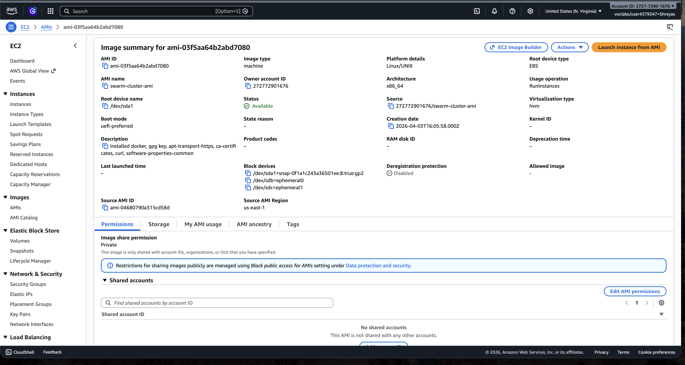
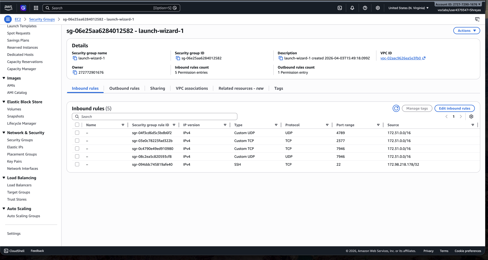
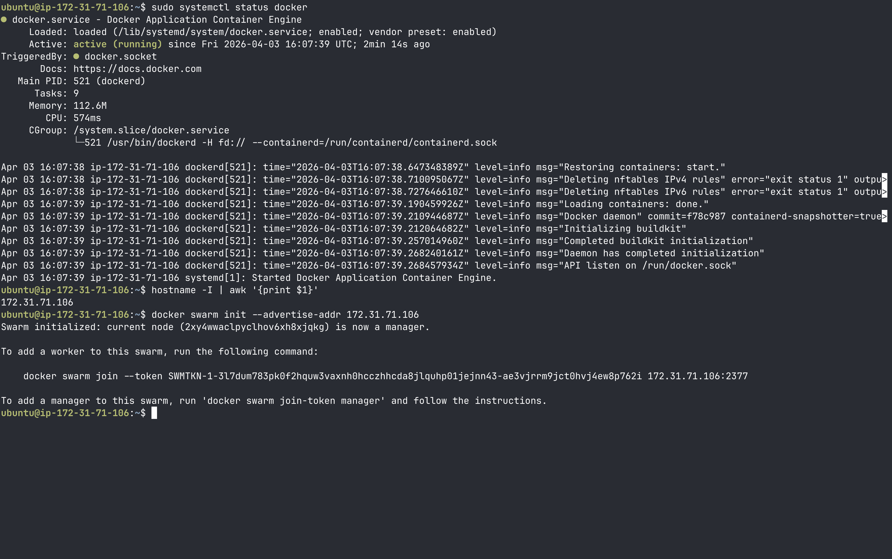
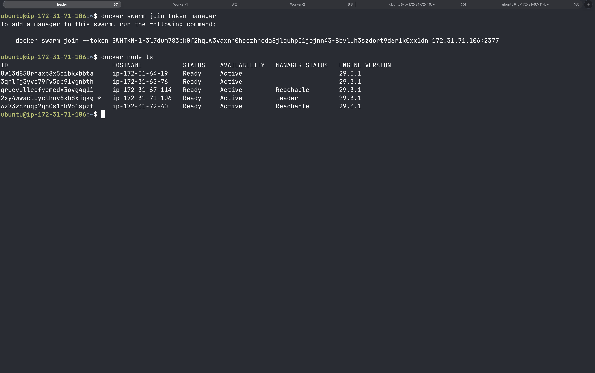
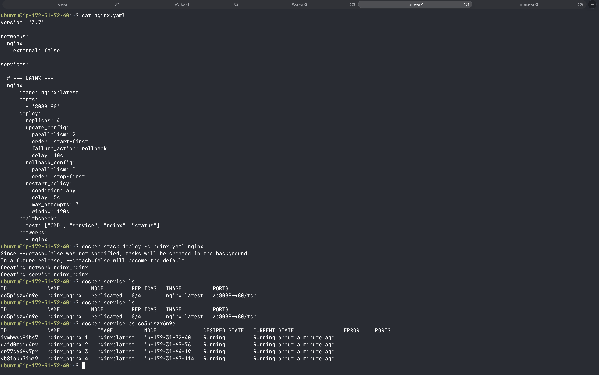
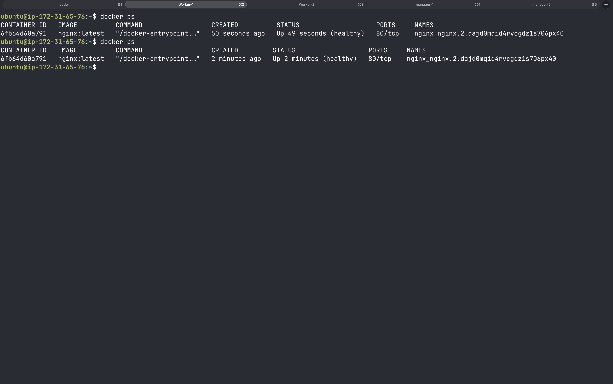
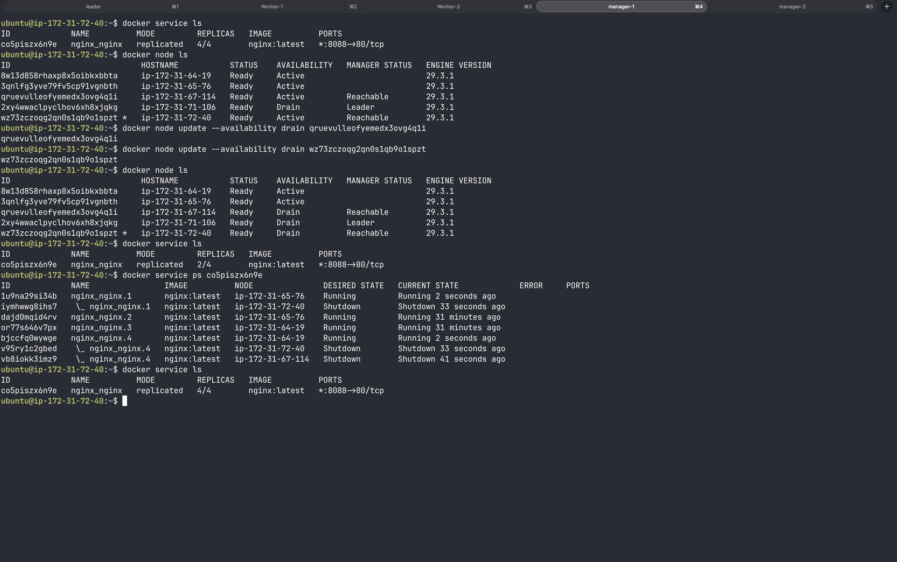
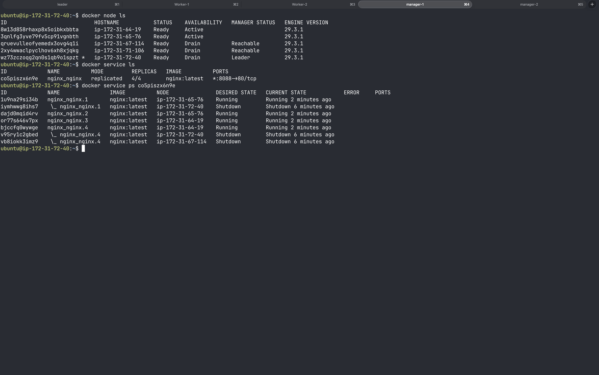
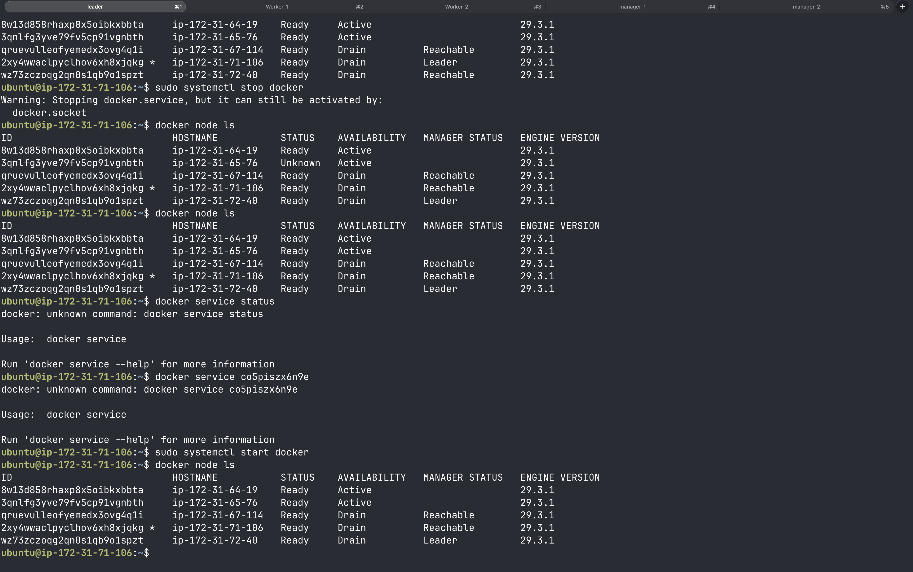

# Assignment 10 – High-Availability Docker Swarm on AWS

**Tutorial followed:** [BetterStack – HA Docker Swarm Guide](https://betterstack.com/community/guides/scaling-docker/ha-docker-swarm/)

---

## Overview

This assignment demonstrates setting up a production-style, highly available Docker Swarm cluster on AWS EC2. The cluster consists of **5 nodes** (3 managers + 2 workers), deploys an Nginx service with 4 replicas, and validates high-availability by draining nodes and simulating a node failure.

---

## Infrastructure Setup

### Custom AMI

A pre-built AMI (`ami-03f5aa64b2abdf080`) was used to launch all EC2 instances. The AMI had the following pre-installed:

- Docker Engine
- Supporting packages: `apt-transport-https`, `ca-certificates`, `curl`, `gnupg`, `software-properties-common`

This ensured all nodes had a consistent Docker environment without manual per-node setup.



---

### Security Group Configuration

Security group `sg-06e25aa628401582` (`launch-wizard-1`) was configured with the following inbound rules to allow Docker Swarm inter-node communication:

| Protocol   | Port | Purpose                                      |
|------------|------|----------------------------------------------|
| TCP        | 22   | SSH access                                   |
| TCP        | 2377 | Swarm cluster management traffic             |
| TCP/UDP    | 7946 | Node-to-node communication                   |
| UDP        | 4389 | Overlay network traffic (VXLAN)              |

All Swarm ports were scoped to the VPC CIDR (`172.31.0.0/16`) for internal-only access.



---

## Cluster Initialization

### Step 1 – Verify Docker on Manager Node

SSH into the designated manager node and confirm Docker is active:

```bash
sudo systemctl status docker
```

Docker was confirmed `active (running)`.

### Step 2 – Retrieve Manager's Private IP

```bash
hostname -I | awk '{print $1}'
# Output: 172.31.71.106
```

### Step 3 – Initialize the Swarm

```bash
docker swarm init --advertise-addr 172.31.71.106
```

Output confirmed:
```
Swarm initialized: current node (2Xyx4emacIpyc1hoovAhbklm) is now a manager.
```

A join token for workers was printed. To retrieve the manager join token separately:

```bash
docker swarm join-token manager
```



---

## Adding Nodes to the Swarm

Worker and additional manager nodes were joined using the respective `docker swarm join` commands with the tokens generated above.

### Final Cluster – 5 Nodes

```bash
docker node ls
```

| Node IP           | Status | Availability | Manager Status | Engine  |
|-------------------|--------|--------------|----------------|---------|
| ip-172-31-64-19   | Ready  | Active       | –              | 29.3.1  |
| ip-172-31-65-76   | Ready  | Active       | –              | 29.3.1  |
| ip-172-31-67-114  | Ready  | Active       | Reachable      | 29.3.1  |
| ip-172-31-71-106  | Ready  | Active       | **Leader**     | 29.3.1  |
| ip-172-31-72-40   | Ready  | Active       | Reachable      | 29.3.1  |

- **3 Manager nodes** (1 Leader + 2 Reachable) — provides quorum fault tolerance
- **2 Worker nodes**



---

## Deploying a Service Stack

### nginx.yaml

```yaml
version: '3.9'

networks:
  nginx:
    external: false

services:
  # --- NGINX ---
  nginx:
    image: nginx:latest
    ports:
      - '8080:80'
    deploy:
      replicas: 4
      update_config:
        parallelism: 2
        order: start-first
        failure_action: rollback
        delay: 10s
      rollback_config:
        parallelism: 0
        order: stop-first
      restart_policy:
        condition: any
        delay: 5s
        max_attempts: 3
        window: 120s
    healthcheck:
      test: ["CMD", "service", "nginx", "status"]
      interval: 10s
```

### Deploy the Stack

```bash
docker stack deploy -c nginx.yaml nginx
```

### Verify Service

```bash
docker service ls
```

```
ID            NAME          MODE        REPLICAS   IMAGE          PORTS
col5pszx8nNe  nginx_nginx   replicated  4/4        nginx:latest   *:8080->80/tcp
```

```bash
docker service ps col5pszx8nNe
```

All 4 replicas were distributed across multiple nodes and reported `Running`.



### Verify Containers on a Worker Node

SSH into `ip-172-31-65-76` (a worker node) and run:

```bash
docker ps
```

Two nginx containers were confirmed running and `healthy` on that node.



---

## High-Availability Testing

### Test 1 – Node Draining

Nodes were drained to simulate maintenance (e.g., patching, upgrades). Swarm automatically rescheduled the tasks onto remaining active nodes.

```bash
docker node update --availability drain gruevulleofyemedx3ovg4q11
docker node update --availability drain wz73zccogp2qnd1q0h9ol1pzt
```

After draining, `docker service ls` still showed `4/4` replicas — Swarm migrated all tasks to the remaining active nodes with zero downtime.

```bash
docker service ps col5pszx8nNe
```

Old tasks on drained nodes transitioned to `Shutdown`; replacement tasks on active nodes were `Running`.





---

### Test 2 – Simulating a Node Failure

Docker was stopped on one of the manager nodes to simulate an unexpected failure:

```bash
sudo systemctl stop docker
```

Observations from the remaining manager:
- The stopped node's status changed to `Unknown` in `docker node ls`.
- The Swarm cluster remained operational (quorum was maintained with 2 of 3 managers still up).
- After restarting Docker on the node (`sudo systemctl start docker`), it rejoined the cluster and returned to `Ready` state.

```bash
sudo systemctl start docker
docker node ls   # Node back to Ready
```



---

## Environment Summary

| Component | Value |
|---|---|
| Cloud Provider | AWS EC2 |
| AMI | `ami-03f5aa64b2abdf080` (custom, Docker pre-installed) |
| Number of Nodes | 5 (3 managers, 2 workers) |
| Docker Engine Version | 29.3.1 |
| Swarm Manager (Leader)
| Service Deployed | Nginx (4 replicas, port 8080) |
| Security Group 
